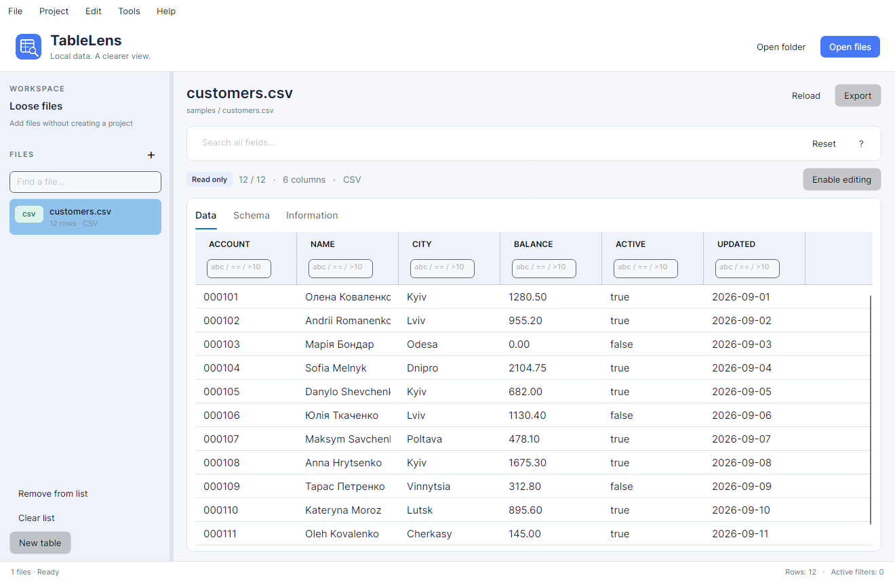
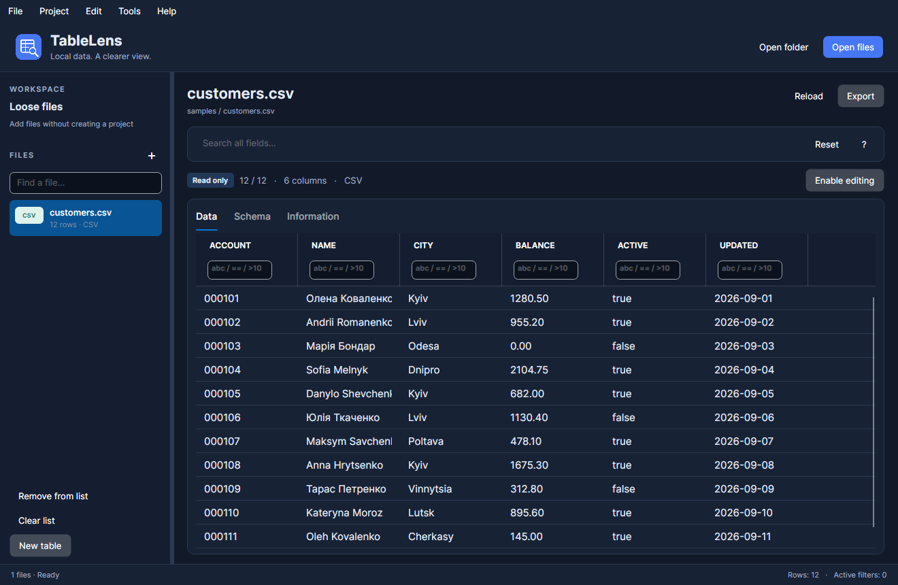

<p align="center"></p>

# TableLens

**A focused desktop workspace for DBF, CSV and JSON.** Open local tables, inspect their structure, filter records and make changes with a clear undo history. Your data stays on your computer.

[Українська інструкція](docs/USER_GUIDE.uk.md) · [Architecture](docs/ARCHITECTURE.md) · [Validation](docs/VALIDATION.md)



## What you can do

- Open several files, drop a folder, or discover tables recursively in subfolders.
- Work with loose files or save a named workspace as a portable `.tablelens.json` project.
- Search across columns, combine per-column filters and sort by clicking a column name.
- Inspect field types, DBF lengths, expected fields and descriptions in a dedicated schema tab.
- Enable editing explicitly, edit cells or an entire row, add/delete records and use Undo/Redo.
- Save through a temporary file, keep a dated backup and reject saves when the source changed externally.
- Export all records or the filtered view as UTF-8 CSV or structured JSON. DBF sources can also export to DBF.
- Create an empty CSV, JSON or dBase III table; edit the DBF schema without changing the source until Save.
- Compare two schemas or recursively compare folders of DBF files.
- Use Ukrainian or English, follow the system theme, or choose a light/dark theme.



## Format support

| Format | Reading | Editing and saving | Details |
| --- | --- | --- | --- |
| DBF | Through DotNetDBF; companion DBT files are picked up by the reader | dBase III without memo; Char, Numeric, Float, Date and Logical | CP866 by default; other encodings are selectable. Partial/corrupt results, duplicate names and unsupported variants remain read-only. |
| CSV / TSV | Quoted separators, escaped quotes and multiline fields | Yes, including adding/deleting rows | Comma, semicolon, tab or pipe detection; manual delimiter, encoding and header options. Identifiers such as `000123` stay text. |
| JSON | Object arrays, a single object, or an object containing a table array | Yes | Numbers, booleans, nulls, nested values, absent properties and wrapper metadata are preserved. An explicit array property resolves ambiguous wrappers. |

JSON scalar arrays such as `[1, 2, 3]` are not tabular input. Nested objects and arrays appear as JSON in their cells and are edited through **Edit row**. DBF schema conversion is deliberately limited to existing DBF documents; exporting arbitrary CSV/JSON to DBF would need explicit field types, lengths and conversion rules.

CSV does not define data types or distinguish null from an empty cell. Exporting to CSV flattens cell values into text. Duplicate or empty CSV headers are normalized for viewing and make the source read-only; export creates a separate normalized file. Empty JSON arrays do not carry a column schema.

## Run from source

Install the [.NET 10 SDK](https://dotnet.microsoft.com/download/dotnet/10.0). The SDK baseline is pinned in `global.json`, with compatible later feature bands allowed.

```bash
dotnet restore TableLens.sln
dotnet run --project src/TableLens.Desktop
```

You can also open `TableLens.sln` in Rider or a current Visual Studio with .NET 10 support. No database, backend service, LibreOffice or additional file converter is required.

To open files directly:

```bash
dotnet run --project src/TableLens.Desktop -- ./samples/customers.csv ./samples/projects.json
```

**Try sample files** opens the bundled examples. `samples/no-header.tsv` is intended for the **First CSV row contains headers** option turned off.

Desktop targets: Windows x64, macOS Apple Silicon/Intel and Linux x64/Arm64. Use a supported OS for [.NET 10](https://github.com/dotnet/core/blob/main/release-notes/10.0/supported-os.md) and [Avalonia](https://docs.avaloniaui.net/docs/supported-platforms), such as a current Windows 11, macOS 15+ or Ubuntu 22.04/24.04 desktop. On Linux, a graphical session and standard X11/font libraries are needed. Reading runs in the background; tables are loaded into memory, so available RAM is the practical file-size limit.

## Build and test

```bash
dotnet build TableLens.sln -c Release
dotnet test tests/TableLens.Tests/TableLens.Tests.csproj -c Release
```

Tests cover format round trips, backups, external modification detection, corrupted DBF data, filtering, undo, project portability and actual Avalonia controls running headlessly. `docs/VALIDATION.md` records the checks completed for this delivery and the platform checks still requiring native hosts.

The GitHub CI workflow builds and tests on Linux, Windows and macOS after a push or pull request. The workflow is included; its first hosted run happens in your repository.

## Package the desktop app

PowerShell 7 creates a self-contained archive and a checksum:

```powershell
./scripts/publish.ps1 -Runtime win-x64
./scripts/publish.ps1 -Runtime osx-arm64
./scripts/publish.ps1 -Runtime linux-x64
```

macOS packaging produces a `TableLens.app` bundle. Run the macOS packaging step on macOS to apply an ad-hoc signature. Public macOS distribution still requires your own Developer ID signature and notarization; this repository contains no signing credentials. Windows packages are portable folders in a ZIP. Linux packages are TAR.GZ archives that retain executable permissions.

The shell script publishes an unpackaged self-contained folder:

```bash
bash scripts/publish.sh linux-x64
```

Output goes to `artifacts/`. Release builds keep all required resources beside the executable and do not use trimming, which could remove dynamic column binding or DBF reflection paths.

To publish on GitHub, extract this project, create a repository and push its contents:

```bash
git init -b main
git add .
git commit -m "Add TableLens desktop application"
git remote add origin <your-repository-url>
git push -u origin main
```

After CI passes, pushing a version tag starts the five-platform release workflow:

```bash
git tag v1.0.0
git push origin v1.0.0
```

The workflow runs tests on each build host before packaging. Cross-publishing an Arm64 or Intel artifact does not replace testing it on that architecture. A manual workflow run builds downloadable artifacts without creating a release.

## Filters and shortcuts

| Input under a column | Meaning |
| --- | --- |
| `Kyiv` | Contains `Kyiv` |
| `==Kyiv` | Exact value |
| `!Kyiv` | Does not contain |
| `!=` | Non-empty |
| `==null` | Empty or null |
| `=="null"` | Literal text `null` |
| `>10`, `<=100` | Numeric/date comparison; numeric CSV text columns compare as numbers |
| `==Kyiv or ==Lviv` | Either exact value |

Conditions in different columns are combined with AND. Search is combined with those filters. For a CSV column containing non-numeric text, comparisons use text ordering. A malformed filter leaves the last valid view in place and reports the error in the status bar.

Use **Ctrl** on Windows/Linux and **⌘** on macOS: `O` opens files, `Shift+O` adds them, `N` creates a table, `S` saves, `E` exports, `F` focuses search, and `Z` / `Y` undo/redo. `F5` reloads the current table. Copy selected rows with `C` or use the grid context menu to copy a cell. Text inputs retain their normal editing shortcuts.

## Storage and migration

Settings and the editable DBF field catalog live in the OS application-data folder under `TableLens`, separate from the installation. Column widths/order are stored per file. User-selected project files contain relative paths when possible and preserve per-file import options. File data is not stored in a project and is not uploaded anywhere.

The bundled field catalog and the DBF reading, filtering, comparison and editing components were carried forward from the supplied WinForms project. Existing WinForms project JSON files with `Name` and `FilePaths` can be opened through **Open project**. Old catalog customizations are not silently migrated: copy the customized `dbf-field-catalog.json` into TableLens's application-data folder if you want to retain them.

## Implementation

Three projects: `TableLens.Core`, `TableLens.Desktop` and `TableLens.Tests`. File logic has no UI dependency. The desktop shell uses XAML and focused event handlers; there is no DI container, service locator, ORM, plugin system or repository layer. See [the architecture notes](docs/ARCHITECTURE.md) for extension points.

## License

[MIT](LICENSE). Dependencies retain their own licenses; see [THIRD_PARTY_NOTICES.md](THIRD_PARTY_NOTICES.md).
